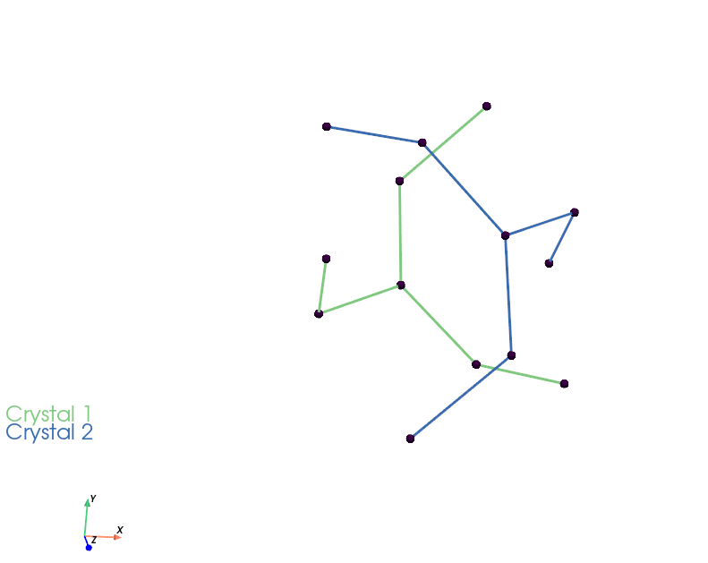
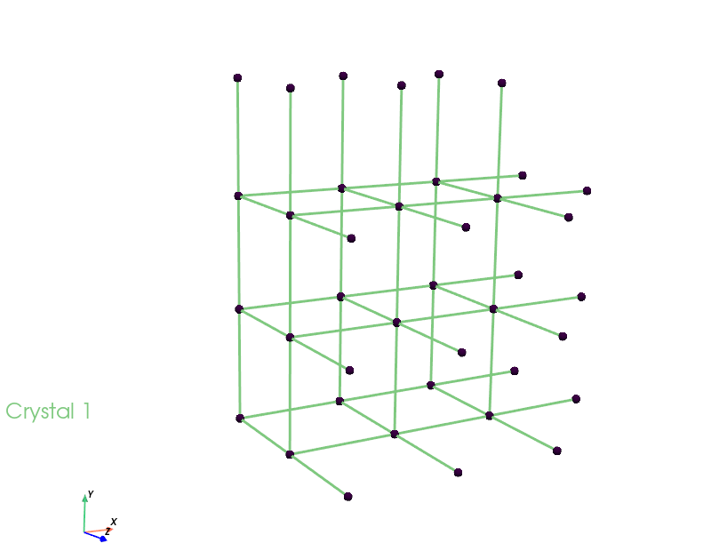

# Minimal Surfaces
Minimal surfaces are so interesting in that they are minimal any any location in space. Perhaps minimal surfaces and the history behind mathematically defining them are of interesting topics in math history. 

## Representation of Minimal Surfaces
There are a wide list of representions for minimal surfaces. However, the easiest is to use skeletons where two graphs are representing a minmal surface. Graphs are preferred in that they let parameterizing these shapes easier. 

### Medial axis repr. of Minimal Surfaces
For representing minimal surfaces with graphs, we can define two graphs where an imaginary blow in them can lead to a touching surface which is known as the minimal surface. For extending graphs and periodically repeating them in space, we need the graphs themselves  (unit cells) and 3 vectros through which these graphs can be periodically repeated and build a crystal. We name them g1, g2, g3 which are technically known as generator vectors. 

### Current tool
This repo is a simple tool for fine-tuning and generating unit cells and crystals of of minimal surfaces. The focus is on their medial axis (skeletons).

```python
import numpy as np


from minimal_surface_skeletons import Gyroid
from utils import plotter                                  
from crystal import Crystal

g3 = Gyroid(edge_param=np.array([1, 1, 1, 1, 1, 1]), 
                angle_param=np.array([2*np.pi/3, 2*np.pi/3, 2*np.pi/3, 2*np.pi/3, 2*np.pi/3]), 
                classic_cubic=False)
                  

crystal2 = Crystal(unit_cell=g3.skelton_chalnnel2, g1_dim=1, g2_dim=1, g3_dim=1)    
crystal3 = Crystal(unit_cell=g3.skelton_chalnnel1, g1_dim=1, g2_dim=1, g3_dim=1)
crystals = [crystal2, crystal3]
plotter(crystals=crystals)
    
```



```python
import numpy as np


from minimal_surface_skeletons import Primitive
from utils import plotter                                  
from crystal import Crystal

g1 = Primitive(classic_cubic=True)

crystal1 = Crystal(unit_cell=g1.skelton_chalnnel1, g1_dim=3, g2_dim=3, g3_dim=2)
crystals = [crystal1]
plotter(crystals=crystals)    
```


## Multiple crystals
It also allows you to add and plot multiple crystals in one plotter. As an example,
by running ```main.py```, you will get

