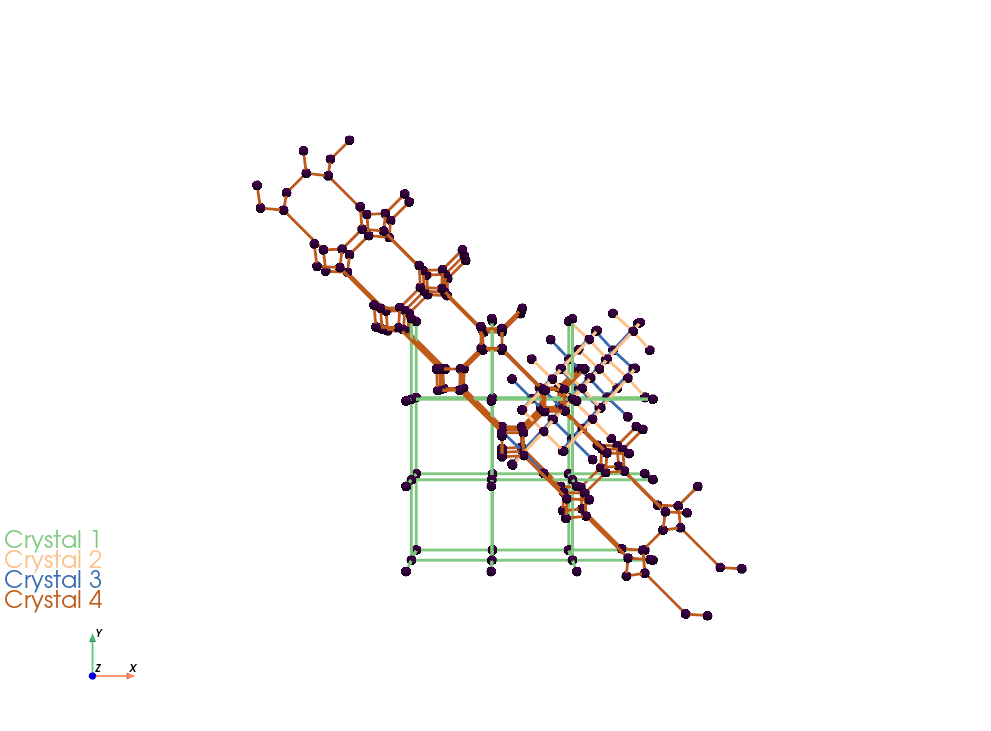

# MinimalSurfaceCrystals
A simple tool for fine-tuning and generating unit cells and crystals of of minimal surfaces. The focus is on their medial axis (skeletons).

```python
g1 = Primitive(classic_cubic=True)
crystal1 = Crystal(unit_cell=g1.skelton_chalnnel1, g1_dim=3, g2_dim=3, g3_dim=2)
crystals = [crystal1]
plotter(crystals=crystals)    
```


By running ```main.py```, you will get

